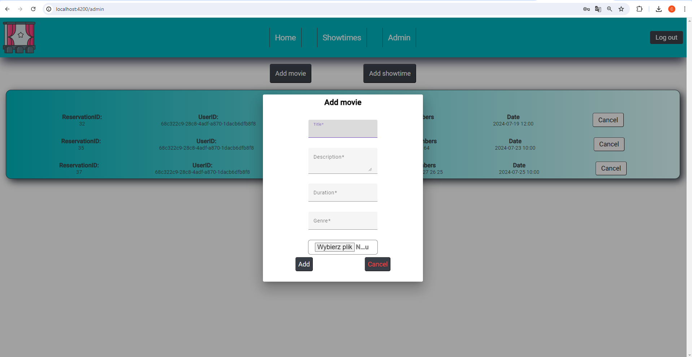

## Name

Cinema-Reservation-System

## Disclaimer

The application code is confidental due to internship rules

## Description

This project is a Cinema Reservation System - a fullstack app built using ASP.Net and Angular as an onboarding application during internship at Comarch BI Point team.

## Details of the application

The showtimes take place from 8:00 a.m. to 11:00 p.m.
After each, there is a 15-minute break to clean the room.

The application has two types of users.

-   Regular user who has access to the ticket booking module and his/her profile.
-   Administrator who can add films (name, description, poster and duration) and create a schedule of showtimes (Assigning given films to a given hour on a specific date) and preview users assigned to a given screening.

The user creates an account by providing name, surname, email and password.

The administrator creates an account just like a regular user, then the administrator role is manually assigned to him from the data warehouse (database or other structure).

The user can reserve one or several seats for a given showtime. You may also cancel this reservation up to 30 minutes after the start of the showtime.
The reservation proccess is done as follows:

1. User selects a video.
2. The user selects a date from the calendar.
3. The user selects a showtime.
4. The user selects a place.
   A diagram of a cinema hall with seats appears, where reserved seats are no longer available and are marked accordingly. The user selects free seats by clicking on them or cancels the previously selected seat by clicking again. Selected places are marked accordingly.
5. The user sees a summary and then has the option to confirm.

## Screenshots
**Login page**


**Register page**


**Validation**


**Home page**


**Showtimes form**


**Showtimes list**


**Reservation dialog**


**User info**


**Admin panel**


**Dialog for add a movie**


**Dialog for add a showtime**


## Prerequisites

Make sure you have the following installed:

-   [.NET SDK](https://dotnet.microsoft.com/download)
-   [Node.js and npm](https://nodejs.org/)
-   [Angular CLI](https://angular.io/cli)
-   [PostgreSQL](https://www.postgresql.org/download/) (along with [PgAdmin](https://www.pgadmin.org/download/))
-   [Entity Framework Core tools](https://docs.microsoft.com/en-us/ef/core/cli/dotnet)

## Installation

Follow these steps to set up and run the project.

### 1. Clone the repository

```bash
git clone https://gitlab.czk.comarch/bu140060/plc140490/plc140012/bi_dev_internship/2024/kamil-syktus/cinema-project
cd cinema-project
```

### 2. Set up the PostGreSQL Database

-   Install and configure PostgreSQL and PgAdmin.
-   Create a new database for your application using PgAdmin.
-   Note down your database connection details (server, port, database name, username, password).

### 3. Set up the ASP.NET backend server

-   Navigate to the backend main directory

```bash
cd CinemaBookingSystem
```

-   Update the appsetting.json file with your PostgreSQL connection data. It should look something like this:
    {
    "ConnectionStrings": {
    "DefaultConnection": "Host=localhost;Port=5432;Database=db;Username=admin;Password=admin"
    },
    }

-   Restore NuGet packages

```bash
dotnet restore
```

-   Apply database migrations:

```bash
dotnet ef database update
```

-   Then you can run the backend server like so:

```bash
dotnet run --launch-profile https
```

### 4. Set up the Angular frontend

-   Navigate to the frontend directory from backend directory like so:

```bash
cd ../frontend
```

-   Install the npm packages:

```bash
npm install
```

-   Start Angular development server:

```bash
ng serve
```

## Running the app

After all installations you can start project every time by:

-   Backend server

```bash
cd CinemaBookingSystem
dotnet run --launch-profile https
```

-   Angular server

```bash
cd frontend
ng serve
```

## Additional notes

If you make changes to the database schema, remember to add and apply migrations:

```bash
dotnet ef migrations add <MigrationName>
dotnet ef database update
```

## Project status

Project finished
